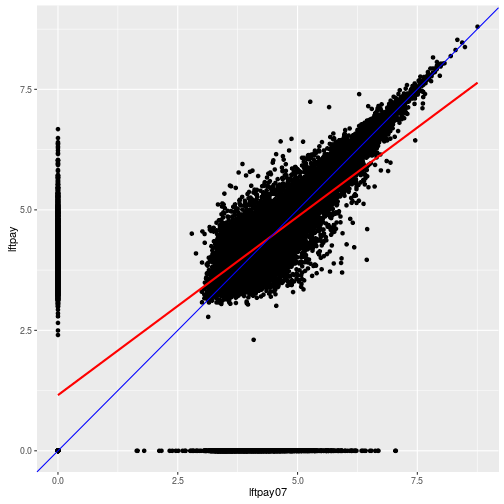

# Working document 

`CompositeRegressionEstimation` is an R package that allows to compute estimators for longitudinal survey:
* Composite Regression ["Fuller, Wayne A., and J. N. K. Rao. "A regression composite estimator with application to the Canadian Labour Force Survey." Survey Methodology 27.1 (2001): 45-52."](http://www.statcan.gc.ca/pub/12-001-x/2001001/article/5853-eng.pdf)estimator contains the source code to reproduce the simulations of [""]() by Bonnery, Lahiri and Tran
* Yansaneh Fuller
* AK estimator
* 
## Install package

```r
devtools::install_github("DanielBonnery/CompositeRegressionEstimation")
```


## R code

```r
library(dataASPEP)
library(pubBonneryLahiriTran2016)
library(ggplot2)
```

#1. Extract data: 2007 and 2012 census corresponding to 2011 sample.


```
FALSE ```r
FALSE function () 
FALSE {
FALSE     data(aspep2007, aspep2011, aspep2012, aspep2007_gov)
FALSE     sqldf::sqldf("\nselect a.id,\n  d.type_of_gov,\n  b.itemcode,\n  d.state,\n  log10(1+c.ftpay) as lftpay, \n  log10(1+a.ftpay) as lftpay07 \nfrom \n   aspep2007 a, \n   aspep2011 b,\n   aspep2012 c,\n   aspep2007_gov d\n   where a.id=b.id \n      and a.id=c.id\n      and a.id=d.id \n      and a.itemcode=b.itemcode  \n      and a.itemcode=c.itemcode")
FALSE }
FALSE <environment: namespace:pubBonneryLahiriTran2016>
FALSE ```
```

##1.1. Plot 1

```r
demo(plot1)
```


```r
print(plot1)
```



#2. Models

##2.1. Simple model

$$\mathrm{ftpay}_{2012,k}=\beta_{0,\mathrm{state}_k,\mathrm{code}_k,\mathrm{type}_k}+
\beta_{0,\mathrm{state}_k,\mathrm{code}_k,\mathrm{type}_k}\times \mathrm{ftpay}_{2007,k}+\varepsilon_k$$


```r
demo(model1)
```


```r
print(plot1)
```


