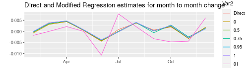

<p align="center">
  
</p>


`CompositeRegressionEstimation` is an R package that allows to compute estimators for longitudinal survey:

* Modified Regression : "Singh, A.~C., Kennedy, B., and Wu, S. (2001). Regression composite estimation for the Canadian Labour Force Survey: evaluation and implementation, Survey Methodology}, 27(1):33--44.", "Singh, A.~C., Kennedy, B., Wu, S., and Brisebois, F. (1997). Composite estimation for the Canadian Labour Force Survey. Proceedings of the Survey Research Methods Section, American Statistical Association}, pages 300--305."  "Singh, A.~C. and Merkouris, P. (1995).  Composite estimation by modified regression for repeated surveys. Proceedings of the Survey Research Methods Section, American Statistical Association}, pages 420--425."


* Composite Regression ["Fuller, Wayne A., and J. N. K. Rao. "A regression composite estimator with application to the Canadian Labour Force Survey." Survey Methodology 27.1 (2001): 45-52."](http://www.statcan.gc.ca/pub/12-001-x/2001001/article/5853-eng.pdf)

* Gauss Markov Best Linear Unbiased Estimator as a linear combinaison of Month in sample estimates.

* AK estimator, Gurney, M. and Daly, J.~F. (1965). A multivariate approach to estimation in periodic sample surveys}.  In Proceedings of the Social Statistics Section, American
  Statistical Association, volume 242, page 257."


This package contains the generic functions that were developped for the journal article ["Bonnery Cheng Lahiri, An Evaluation of Design-based Properties of Different Composite Estimators"](https://arxiv.org/abs/1811.12249).
The demonstration code on this page  uses the `dataCPS` package that allows to download public anonymised CPS micro data from the US Census Bureau website.


#  General usage

## Install


```r
devtools::install_github("DanielBonnery/CompositeRegressionEstimation")
```


## Manual
R package pdf manual can be found there:
["CompositeRegressionEstimation.pdf"](https://github.com/DanielBonnery/CompositeRegressionEstimation/blob/master/CompositeRegressionEstimation.pdf)

# Repeated surveys


The output of a repeated survey is in general a sequence of datasets, 
one dataset for each iteration of the survey. 

## An example: the US Census Bureau CPS survey.

### Variables

The CPS provides 8 different employment categories, but we can regroup some to get 3 categories: 
employed, not employed, not in the labor force.
Each dataset may contain variables that can be described by the same dictionnary, or there may be changes. 

### Rotation group and rotation pattern

The sampling units also usually differ from one dataset to the other, due to non response or due to a deliberate choice not to sample the same units.
Let  be an index of the time, and let  be the set of sampling units at time . The samples  are subsets of a larger population .

Some repeated surveys use rotation groups and a rotation pattern.
For the CPS, each sampled household will be selected to be surveyed during 4 consecutive months,  then left alone 8 months, then
surveyed again 4 consecutive months. As a consequence, for a given month, a sampled units that month will be surveyed for the first, second, ..., or 8th and last time. This induces a partition of the sample into month-in-sample groups:
. 


For each unit  in , usually the dataset contains:
the values  of a variable of interest  for unit  and the period . In particular we are interested in the case where  is a vector of indicator values, :
 means that individual  was not in the labor force at time .

It also contains  a sampling weight.


#### Get the data
The R package `dataCPS` available there: ["github.com/DanielBonnery/dataCPS"](github.com/DanielBonnery/dataCPS) contains functions to download the CPS anonymised micro data from the U.S Census Bureau website.

The following code creates a list of dataframes for the months of 2005 that are selection of variables from the CPS public use microdata. It creates a new employment status table with only 3 levels


```r
period<-200501:200512
list.tables<-lapply(data(list=paste0("cps",period),package="dataCPS"),function(x){get(x)[c("hrmis","hrhhid","pulineno","pwsswgt","pemlr","hrintsta")]});names(list.tables)<-period
list.tables<-lapply(list.tables,function(L){
  L[["employmentstatus"]]<-forcats::fct_collapse(factor(L[["pemlr"]]),
                                            "e"=c("1","2"),
                                            "u"=c("3","4"),
                                            "n"=c("5","6","7","-1"));
  L})
```


## Estimation 

The output of a survey are often used to produce estimators of totals over the population of certain characteritics, or function of this same totals, 
in a fixed population model for design-based inference.  

### Linear combinations of month in sample estimates

#### Direct estimate

The direct estimator of the total is . The function `CompositeRegressionEstimation::WS` will produce
the weighted estimates 

In the following code, we compute the direct estimates of the counts in each employment status category from the CPS public anonymised micro data in the year 2005, compute the corresponding unemployment rate time series and plot the result.

```r
Direct.est<-CompositeRegressionEstimation::WS(list.tables,weight="pwsswgt",list.y = "employmentstatus")
U<-with(as.data.frame(Direct.est),
        (employmentstatus_ne)/(employmentstatus_ne+employmentstatus_nu))
library(ggplot2);
ggplot(data=data.frame(period=period,E=U),aes(x=period,y=U))+geom_line()+
  ggtitle("Direct estimate of the monthly employment rate from the CPS public microdata in 2005")+
  scale_x_continuous(breaks=200501:200512,labels=month.abb)+xlab("")+ylab("")
```


#### Month in sample estimate

An estimate can be obtained from each month-in-sample rotation group. The month-in-sample estimates are estimates of a total of a study variable of the form:
, where  is an adjustment. In the CPS, the adjustment  as there are  rotation groups. Other adjustments are possible, as for example .

The following code  creates the array `Y` of dimension  (M months, 8 rotation groups, 3 employment statuses.) where `Y[m,g,e]` is the month in sample estimate for month `m`, group `g` and status `e`.


```r
library(CompositeRegressionEstimation)
Y<-CompositeRegressionEstimation::WSrg2(list.tables,rg = "hrmis",weight="pwsswgt",y = "employmentstatus")
Umis<-plyr::aaply(Y[,,"e"],1:2,sum)/plyr::aaply(Y[,,c("e","u")],1:2,sum);

  mycolors <- rainbow(8) 
library(ggplot2);ggplot(data=reshape2::melt(Umis),aes(x=m,y=value,color=factor(hrmis),group=hrmis))+geom_line()+
  scale_x_continuous(breaks=200501:200512,labels=month.abb)+xlab("")+ylab("")+ 
  labs(title = "Month-in-sample estimates", 
       subtitle = "Monthly employment rate, year 2005", 
       caption = "Computed from CPS public anonymized microdata.")+
scale_colour_manual(values = mycolors)+
guides(colour=guide_legend(title="m.i.s."))
```


#### Linear combinaisons of the month-in-sample estimates

The month-in-sample estimates for each month and each rotation group can also be given in a data.frame with four variables: the month, the group, the employment status and the value of the estimate.
Such a dataframe can be obtained from `Y` using the function `reshape2::melt`


```r
print(reshape2::melt(Y[,,]))
```


|Row number |Month  |Month in sample group |Employment status |           |
|:----------|:------|:---------------------|:-----------------|:-------------|
|1          |200501 |1                     |n                 |17645785.4304 |
|2          |200502 |1                     |n                 |17526653.25   |
|3          |200503 |1                     |n                 |17905466.5322 |
|...        |...    |...                   |...               |...           |
|288        |200512 |8                     |u                 |846918.8885   |

Let  be the vector of values in the data.frame.
Elements of  can be refered to by the line number or by a combinaison of month, rotation group, and employment status, as for example : , or by a line number .
We use  to designate the vector and  to designate the array.

The values to estimate are the elements of the -sized array . We denote by  the vectorisation of the array .

In R, the function to vectorize an array is the function `c`


```r
A<-array(1:12,c(3,2,2));c(A)
```

```
##  [1]  1  2  3  4  5  6  7  8  9 10 11 12
```


We consider estimates of 
of the form  , 
where  is a matrix of dimension ).

Which is equivalent to estimators of the form  where the  is a  matrix, where an element  of  is indexed by two vector  and  and of length the number of dimensions of the array  and the dimensions of the array  respectively. 

The function `arrayproduct::"%.%"` of the 'arrayproduct' allows to perform the array multiplication as described above.
The package uses named arrays with named dimensions (`names(dimnames(A))` is not `NULL`).

### Recursive linear estimates

The function `CompositeRegressionEstimation::composite` 
allows to compute linear combinations of the month in sample groups of the form


This is a special case of a linear combination of the month-in-sample estimates.


Computing the estimators recursively is not very efficient. At the end, we get a linear combinaison of month in sample estimates.
 
The following code computes a recursive estimator with parameters , .


```r
Yc<-CompositeRegressionEstimation::composite(list.tables,"pwsswgt","employmentstatus",groupvar="hrmis",groups0 = c(2:4,6:8),groups_1=c(1:3,5:7),Coef = c(alpha_1=.5,alpha0=.5,beta_1=0,beta0=0,gamma0=0))
Uc<-Yc[,"employmentstatus_ne"]/(Yc[,"employmentstatus_ne"]+Yc[,"employmentstatus_nu"])
ggplot(data=reshape2::melt(cbind(Direct=U,Composite=Uc)),aes(x=as.Date(paste0(Var1,"01"),"%Y%m%d"),y=value,group=Var2,color=Var2))+geom_line()+xlab("")+ylab("")+ggtitle("Direct and Composite estimates")
```


The function `CompositeRegressionEstimation::composite` computes recursively the estimates.
Another way is to compute recursively the coefficients of the resulting linear combinaison of month in sample weights.
This is performed by the function `CompositeRegressionEstimation::W.rec`


```r
Wrec<-W.rec(months=period,
            groups =paste0("",1:8),
            S = c(2:4,6:8),
            S_1=c(1:3,5:7),
            Coef = c(alpha_1=.5,alpha0=.5,beta_1=0,beta0=0,gamma0=0))
```

Then one can multiply the array 'W' and 'X':


```r
Yc2<-arrayproduct::"%.%"(Wrec,Y,I_A=list(c=integer(0),n="m2",p=c("m1","rg1")),I_B=list(c=integer(0),p=c("m","hrmis"),q="employmentstatus"))
Uc2<-Yc2[,"e"]/(Yc2[,"e"]+Yc2[,"u"])
paste0("The two differnt methods give ",if(all(abs(Uc-Uc2)<1e-3)){"same"}else{"different"}," results");
```

```
## [1] "The two differnt methods give same results"
```


#### AK estimator
The AK composite estimator is equivalently in ``CPS Technical Paper (2006). Design and Methodology of the Current Population Survey. Technical Report 66, U.S. Census Bureau. (2006), [section 10-11]'':

For , .
 
 For , 
 <p align="center"></p>
 

where <p align="center"></p>
 and <p align="center"></p>
 
 For the CPS,  is the ratio between the number of rotation groups in the sample and the number of overlaping rotation groups between two month, 
 which is a constant  ;  is the ratio between the number of non overlaping rotation groups the number of overlaping rotation groups between two month, 
 which is a constant of .


The AK estimator can be defined as follows:
For , .
 
 For , 
<p align="center"></p>
 
 
    
  In the case of the CPS, the rotation group one sample unit  belongs to in a particular month  is a function
 of the number of times it has been selected before, including this month, and so the rotation group of an individual in a particular month is called the "month in sample" variable.
    
 For the CPS, in month  the overlap  corresponds to the individuals in the sample  with a value of month in sample equal to 2,3,4, 6,7 or 8.
 The overlap  corresponds to the individuals in the sample  with a value of month in sample equal to 2,3,4, 6,7 or 8. as well as 
 individuals in the sample  with a value of month in sample equal to 1,2,3, 5,6 or 7. 
 When parametrising the function 'AK', the choice would be `group_1=c(1:3,5:7)` and `group0=c(2:4,6:8)`.


```
CompositeRegressionEstimation::CPS_AK()
```


 The functions `AK3`, computes the linear combination directly and more efficiently. the AK estimates are linear combinations of the month in sample estimates. The function `AK3` computes the coefficient matrix  from the values of , , ,  and performs the matrix product .
The function 'coefAK' produces the coefficients.

The CPS Census Bureau uses different values of A and K for different variables.
For the employmed total, the values used are: , .
For the unemployed total, the values used are: , .
The functions `CPS_A_e`, `CPS_A_u`, `CPS_K_e`, `CPS_K_u`, `CPS_AK()` return these coefficients.


```r
CPS_AK()
```

```
##  a1  a2  a3  k1  k2  k3 
## 0.3 0.4 0.0 0.4 0.7 0.0
```


The matrix  corresponding to the coefficients for the AK estimator for the total of employed can be obtained with:


```r
Wak.e<-W.ak(months=period,
            groups =paste0("",1:8),
            S = c(2:4,6:8),
            S_1=c(1:3,5:7),
            a=CPS_A_e(),k=CPS_K_e(),
            eta0=4/3,
            eta1=1/3,
            rescaled=F)
```

In the same way:

```r
Wak.u<-W.ak(months=period,
            groups =paste0("",1:8),
            S = c(2:4,6:8),
            S_1=c(1:3,5:7),
            a=CPS_A_u(),k=CPS_K_u(),
            eta0=4/3,
            eta1=1/3,
            rescaled=F)
```


The Census AK estimator of the total of employed and unemployed computed with the values of A and K used by the Census are:


```r
Y_census_AK.e<-arrayproduct::"%.%"(Wak.e,Y[,,"e"],
           I_A=list(c=integer(0),n=c("m2"),p=c("m1","rg1")),
           I_B=list(c=integer(0),p=c("m","hrmis"),q=integer(0)))
Y_census_AK.u<-arrayproduct::"%.%"(Wak.u,Y[,,"u"],
                                   I_A=list(c=integer(0),n="m2",p=c("m1","rg1")),
                                   I_B=list(c=integer(0),p=c("m","hrmis"),q=integer(0)))
```
The corresponding unemployment rate time series can be obtained by the ratio :


```r
U_census_AK<-Y_census_AK.e/(Y_census_AK.e+Y_census_AK.u)
```


We plot the Direct estimate vs the AK estimate:


```r
ggplot(data=reshape2::melt(cbind(Direct=U,Composite=U_census_AK)),aes(x=as.Date(paste0(Var1,"01"),"%Y%m%d"),y=value,group=Var2,color=Var2))+geom_line()+xlab("")+ylab("")+ggtitle("Direct and Composite estimates")
```


If we want to get the whole  matrix, we can use the function
'W.multi.ak':


```r
Wak<-W.multi.ak(months=period,
            groups =paste0("",1:8),
            S = c(2:4,6:8),
            S_1=c(1:3,5:7),
            ak=list(u=c(a=CPS_A_u(),k=CPS_K_u()),e=c(a=CPS_A_e(),k=CPS_K_e()),n=c(a=0,k=0)))
```

and the estimates total of employed, unemployed and not in the labor force are obtained with:


```r
Y_census_AK<-arrayproduct::"%.%"(Wak,Y,I_A=list(c="ak",n=c("m2"),p=c("m1","rg1")),I_B=list(c="employmentstatus",p=c("m","hrmis"),q=integer(0)))
U_census_AK2<-Yc2[,"e"]/(Yc2[,"e"]+Yc2[,"u"])
paste0("The two differnt methods give ",if(all(abs(U_census_AK-U_census_AK)<1e-3)){"same"}else{"different"}," results");
```

```
## [1] "The two differnt methods give same results"
```


## Optimisation of the linear combinaisons of the month in sample estimates

In a model where , the design-based covariance matrix of , is known, then the optimal linear estimator could be computed.

Gauss Markov gives us the formula to compute the optimal value of  as a value of . It is given in 
["Bonnery Cheng Lahiri, An Evaluation of Design-based Properties of Different Composite Estimators"](https://arxiv.org/abs/1811.12249)


The model for the month in sample estimate vector  is 
, 
where  is the vector indexed by :  and  is the matrix with rows indexed by  and columns indexed by  such that  if  and ,  otherwise.

The best coefficient array  is the matrix with rows indexed by  and columns indexed by  given by:

<p align="center"></p>


where the  operator designates the Moore Penrose pseudo inversion,  is the
identity matrix. Here the minimisation is with respect to the order on symmetric positive definite matrices:  is positive. It can be shown that  in our case and that . 
The estimator  is the Best Linear Unbiased Estimator under this model.


The next code provides the  and  matrices:


```r
 X<-CPS_X_array(months=list(m=paste(200501:200504)),
             vars=list(y=c("e","u","n")),
             rgs=list(hrmis=paste(1:8)),1/2)
 Xplus<-CPS_Xplus_array(months=list(m=paste(200501:200504)),
             vars=list(y=c("e","u","n")),
             rgs=list(hrmis=paste(1:8)),1/2)
 arrayproduct::"%.%"(Xplus,X,
  I_A=list(c=integer(0),n=c("y2","m2"),p=c("y","hrmis","m")),
  I_B=list(c=integer(0),p=c("y","hrmis","m"),q=c("y2","m2")))
```

```
## , , y2 = e, m2 = 200501
## 
##    m2
## y2  200501 200502 200503 200504
##   e      1      0      0      0
##   u      0      0      0      0
##   n      0      0      0      0
## 
## , , y2 = u, m2 = 200501
## 
##    m2
## y2  200501 200502 200503 200504
##   e      0      0      0      0
##   u      1      0      0      0
##   n      0      0      0      0
## 
## , , y2 = n, m2 = 200501
## 
##    m2
## y2  200501 200502 200503 200504
##   e      0      0      0      0
##   u      0      0      0      0
##   n      1      0      0      0
## 
## , , y2 = e, m2 = 200502
## 
##    m2
## y2  200501 200502 200503 200504
##   e      0      1      0      0
##   u      0      0      0      0
##   n      0      0      0      0
## 
## , , y2 = u, m2 = 200502
## 
##    m2
## y2  200501 200502 200503 200504
##   e      0      0      0      0
##   u      0      1      0      0
##   n      0      0      0      0
## 
## , , y2 = n, m2 = 200502
## 
##    m2
## y2  200501 200502 200503 200504
##   e      0      0      0      0
##   u      0      0      0      0
##   n      0      1      0      0
## 
## , , y2 = e, m2 = 200503
## 
##    m2
## y2  200501 200502 200503 200504
##   e      0      0      1      0
##   u      0      0      0      0
##   n      0      0      0      0
## 
## , , y2 = u, m2 = 200503
## 
##    m2
## y2  200501 200502 200503 200504
##   e      0      0      0      0
##   u      0      0      1      0
##   n      0      0      0      0
## 
## , , y2 = n, m2 = 200503
## 
##    m2
## y2  200501 200502 200503 200504
##   e      0      0      0      0
##   u      0      0      0      0
##   n      0      0      1      0
## 
## , , y2 = e, m2 = 200504
## 
##    m2
## y2  200501 200502 200503 200504
##   e      0      0      0      1
##   u      0      0      0      0
##   n      0      0      0      0
## 
## , , y2 = u, m2 = 200504
## 
##    m2
## y2  200501 200502 200503 200504
##   e      0      0      0      0
##   u      0      0      0      1
##   n      0      0      0      0
## 
## , , y2 = n, m2 = 200504
## 
##    m2
## y2  200501 200502 200503 200504
##   e      0      0      0      0
##   u      0      0      0      0
##   n      0      0      0      1
```


The estimator  is the Best Linear Unbiased Estimator under this model.


```r
beta= matrix(rchisq(12,1),4,3)
dimnames(beta)<-list(m=paste(200501:200504),y=c("e","u","n"))
 X<-CPS_X_array(months=list(m=paste(200501:200504)),
             vars=list(y=c("e","u","n")),
             rgs=list(hrmis=paste(1:8)))
 Xplus<-CPS_Xplus_array(months=list(m=paste(200501:200504)),
             vars=list(y=c("e","u","n")),
             rgs=list(hrmis=paste(1:8)),1/2)
 EY<-arrayproduct::"%.%"(X,beta,I_A=list(c=integer(0),n=c("m","y","hrmis"),p=c("m2","y2")),I_B=list(c=integer(0),p=c("m","y"),q=integer(0)))
 set.seed(1)
 Sigma=rWishart(1,length(EY),diag(length(EY)))
 Y<-array(mvrnorm(n = 100,mu = c(EY),Sigma = Sigma[,,1]),c(100,dim(EY)))
 dimnames(Y)<-c(list(rep=1:100),dimnames(EY))
 Sigma.A<-array(Sigma,c(dim(EY),dim(EY)))
 dimnames(Sigma.A)<-rep(dimnames(EY),2);names(dimnames(Sigma.A))[4:6]<-paste0(names(dimnames(Sigma.A))[4:6],"2")
 W<-CoeffGM.array(Sigma.A,X,Xplus)
 WY<-arrayproduct::"%.%"(W,Y,I_A=list(c=integer(0),n=c("y2","m2"),p=c("m","y","hrmis")),I_B=list(c=integer(0),p=c("m","y","hrmis"),q=c("rep")))
 DY<-arrayproduct::"%.%"(Xplus,Y,I_A=list(c=integer(0),n=c("y2","m2"),p=c("m","y","hrmis")),I_B=list(c=integer(0),p=c("m","y","hrmis"),q=c("rep")))
 plot(c(beta),c(apply(DY,1:2,var)),col="red")
```


```r
 plot(c(beta),c(apply(WY,1:2,var)))
```


#### Best AK estimator for level, change and compromise
When  is known, the best linear estimate of  is . What is true for the Best linear estimate is not 
true for all the best linear estimate in a subclass of the linear estimates.
For example, the best coefficients A and K for month to month change may not be the best coeeficients for level of employement.
One needs to define a compromise target to define what is the optimal  and  coefficients.

The following code gives the A and K coefficient as a function of  that minimise ...


```r
to be done
```

When  is known, 

#### Empirical best estimators and estimation of 

As  is not known, the approach adopted by the Census has been for total of employed and total of unemployed separately to plugin an estimate of , and then try values of  and  between
0 and 1 with one decimal value and take the ones tha minimize the estimated variance.

There are many issues with this approach:

* The optimisation method: 
- The optimal was chosen on a grid, so the optimal may have been missed.
- The optimal was chosen variable by variable, which is only optimal when estimates of different variables are uncorrelated, which is not the case: there is a negative relationship between unemployment, employment and not in the labor force: a sample with a high level of employed and unemployed will have a low level of not in the labor force.
* No robustness
- The estimation of  was done with really strong variance stationarity assumption, which is unrealistic when one observes the evolution of the employment during the last decade.
- No study to my knowledge was done to show how good this estimation of  was.
- the empirical best will be very sensitive to the values of .

## Modified Regression Estimators (Singh) including Regression Composite Estimator, Fuller-Rao)


The `MR` function allows to compute the general class of "modified regression" estimators  proposed by Singh, see: 
* "Singh, A.~C., Kennedy, B., and Wu, S. (2001). Regression composite estimation for the Canadian Labour Force Survey: evaluation and implementation, Survey Methodology}, 27(1):33--44."
* "Singh, A.~C., Kennedy, B., Wu, S., and Brisebois, F. (1997). Composite estimation for the Canadian Labour Force Survey. Proceedings of the Survey Research Methods Section, American
  Statistical Association}, pages 300--305."
* "Singh, A.~C. and Merkouris, P. (1995). Composite estimation by modified regression for repeated surveys. Proceedings of the Survey Research Methods Section, American Statistical Association}, pages 420--425."

Modified regression is  general approach that consists in calibrating on one or more proxies for "the previous month". Singh describes what properties the proxy variable has to follow, and proposes two diferent proxy variables (proxy 1, proxy 2), as well as using the two together. The estimator obtained with proxy 1 is called "MR1", the estimator obtained with proxy 2 is called "MR2"" and the estimator obtained with both proxy 1 and proxy 2 in the model is called MR3. "Fuller, W.~A. and Rao, J. N.~K. (2001).  A regression composite estimator with application to the Canadian Labour Force Survey, Survey Methodology}, 27(1):45--51), use an estimator in the class described by Singh that with a proxy chosen to be an affine combination of proxy 1 and proxy 2. The coefficient of the combination is denoted  and the Modified Regression estimator obtained is called by the authors Regression Composite estimator.  gives MR1 and  gives MR2.

For  , the  regression composite estimator of   is a calibration  estimator  defined as follows:
provide calibration totals  for the auxiliary variables (they can be equal to the true totals when known or estimated), then  define   and  if , 0 otherwise. 
For ,  recursively define 

<p align="center"></p>
where .

Then the regression composite estimator of  is given by <p align="center"></p>
where 
<p align="center"></p>
and  where  if  and  otherwise.

The following code allows to compute the Regression composite estimation (MR1 corresponds to , MR2 corresponds to , and MR3 to 'Singh=TRUE') In this example we compute MR1, MR2, MR3 and regression composite for  and  .


```r
list.tables<-lapply(list.tables,dplyr::mutate,const=1)
YMR<-MR(list.tables,
   w="pwsswgt",
   list.xMR="employmentstatus",
   id=c("hrhhid","pulineno"),
   list.x1="const",
   Alpha=c(0,.5,.75,.95,1),
   list.y=c("employmentstatus"))$dfEst;
   UMR<-YMR[,"employmentstatus_ne",]/(YMR[,"employmentstatus_ne",]+YMR[,"employmentstatus_nu",])
   ggplot(data=reshape2::melt(cbind(Direct=U,Composite=UMR)),aes(x=as.Date(paste0(Var1,"01"),"%Y%m%d"),y=value,group=Var2,color=Var2))+geom_line()+xlab("")+ylab("")+ggtitle("Direct and Modified Regression Estimates")
```


```r
   diffUMR<-cbind(Direct=U,Composite=UMR)[-1,]-cbind(Direct=U,Composite=UMR)[-12,]
   ggplot(data=reshape2::melt(cbind(diffUMR)),aes(x=as.Date(paste0(Var1,"01"),"%Y%m%d"),y=value,group=Var2,color=Var2))+geom_line()+xlab("")+ylab("")+ggtitle("Direct and Modified Regression estimates for month to month change")
```


