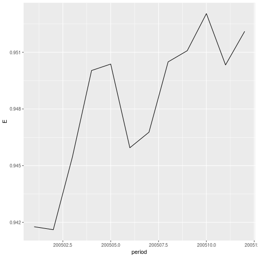

`CompositeRegressionEstimation` is an R package that allows to compute estimators for longitudinal survey:
* Composite Regression ["Fuller, Wayne A., and J. N. K. Rao. "A regression composite estimator with application to the Canadian Labour Force Survey." Survey Methodology 27.1 (2001): 45-52."](http://www.statcan.gc.ca/pub/12-001-x/2001001/article/5853-eng.pdf)
* Yansaneh Fuller
* AK estimator

#  General usage

## Install


```r
devtools::install_github("DanielBonnery/CompositeRegressionEstimation")
```
## Demonstration code
This package has been used for the paper submitted by D. Bonnery, P. Lahiri and Y. Cheng on real data (CPS data).
One can consult the pdf package documentation on the github page to see demo code.

Below is given a basic demonstration code on a simulated dataset


```r
library(CompositeRegressionEstimation)
data(CRE_data)
example(MR)
```

## Manual
R package pdf manual can be found there:
["CompositeRegressionEstimation.pdf"](https://github.com/DanielBonnery/CompositeRegressionEstimation/blob/master/CompositeRegressionEstimation.pdf)

# Repeated surveys

### An example: the US Census Burea CPS survey.

The output of a repeated survey is in general a sequence of datasets, 
one dataset for each iteration of the survey. Each dataset may contain variables that can be described by the same dictionnary, or there may be changes. 

#### Rotation group and rotation pattern

The sampling units also usually differ from one dataset to the other, due to non response or due to a deliberate choice not to sample the same units.
Some repeated surveys use rotation groups and a rotation pattern.
For the CPS, each sampled household will be selected to be surveyed during 4 consecutive months,  then left alone 8 months, then
surveyed again 4 consecutive months. As a consequence, for a given month, a sampled units that month will be surveyed for the first, second, ..., or 8th and last time. This induces a partition of the sample into month-in-sample groups:
$S_m=S_{m,1}\cup S_{m,2}\cup, \ldots,  S_{m,8}$. 

Let $m\in\{1,\ldots,M\}$ be an index of the time, and let $S_m$ be the set of sampling units at time $m$. The samples $S_m$ are subsets of a larger population $U$.

For each unit $k$ in $S_m$, usually the dataset contains:
the values $Y_{m,k}$ of a variable of interest $Y$ for unit $k$ and the period $m$.
It also contains $w_{m,k}$ a sampling weight.


#### Get the data
The R package `dataCPS` available there: ["github.com/DanielBonnery/dataCPS"](github.com/DanielBonnery/dataCPS) contains functions to download the CPS anonymised micro data from the Census Website.


## Estimation 

The output of a survey are often used to produce estimators of totals over the population of certain characteritics, or function of this same totals, 
in a fixed population model for design-based inference.  

### Linear estimates

#### Direct estimate

The direct estimator of the total is $\sum_{k\in S_m} w_{k,m} Y_{k,m}$. The function `CompositeRegressionEstimation::WS` will produce
the weighted estimates $(\sum_{k\in S_m} w_{k,m} Y_{k,m})_{m\in\{1,\ldots,M\}}$

In the following code, we compute the direct estimates of the counts in each employment status category from the CPS public anonymised micro data in the year 2005, compute the corresponding unemployment rate time series and plot the result.

```r
period<-200501:200512
list.tables<-lapply(data(list=paste0("cps",period),package="dataCPS"),get);names(list.tables)<-period
Direct.est<-CompositeRegressionEstimation::WS(list.tables,weight="pwsswgt",list.y = "pemlr")
Direct.emp.rate<-with(as.data.frame(Direct.est),(pemlr_n1 +pemlr_n2)/(pemlr_n1 +pemlr_n2+ pemlr_n3 +pemlr_n4))
library(ggplot2);ggplot(data=data.frame(period=period,E=Direct.emp.rate),aes(x=period,y=E))+geom_line()+
  ggtitle("Direct estimate of the monthly employment rate from the CPS public microdata in 2005")+
  scale_x_continuous(breaks=200501:200512,labels=month.abb)+xlab("")+ylab("")
```



#### Month in sample estimate

An estimate can be obtained from each month-in-sample rotation group. The month-in-sample estimates are estimates of a total of a study variable of the form:
$\sum_{k\in S_{m,g} w_{m,k}Y_{m,k}$.
The following code 

```r
MIS.est<-CompositeRegressionEstimation::WSrg(list.tables,rg = "hrmis",weight="pwsswgt",list.y = "pemlr")
MIS.emp.rate<-plyr::aaply(MIS.est[,,c("pemlr_n1","pemlr_n2")],1:2,sum)/plyr::aaply(MIS.est[,,c("pemlr_n1","pemlr_n2","pemlr_n3","pemlr_n4")],1:2,sum);names(dimnames(MIS.emp.rate))<-c("Month","RotationGroup")
library(ggplot2);ggplot(data=reshape2::melt(MIS.emp.rate),aes(x=Month,y=value,color=RotationGroup))+geom_line()+
  scale_x_continuous(breaks=200501:200512,labels=month.abb)+xlab("")+ylab("")+ 
  labs(title = "Month-in-sample estimates", 
       subtitle = "Monthly employment rate, year 2005", 
       caption = "Computed from CPS public anonymized microdata.")
```


#### AK estimator

```
CompositeRegressionEstimation::CPS_AK()
```


#### Rough estimation of the month-in-sample estimate covariance matrix

#### Empirical best AK estimator

#### Empirical best YF estimator

#### Empirical best linear estimator

### Modified regression (Singh, Fuller-Rao)


