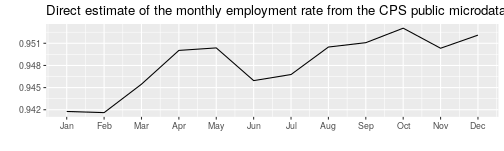

`CompositeRegressionEstimation` is an R package that allows to compute estimators for longitudinal survey:
* Composite Regression ["Fuller, Wayne A., and J. N. K. Rao. "A regression composite estimator with application to the Canadian Labour Force Survey." Survey Methodology 27.1 (2001): 45-52."](http://www.statcan.gc.ca/pub/12-001-x/2001001/article/5853-eng.pdf)

* Gauss Markov BLUE

* AK estimator

This package contains the generic functions that were developped for the journal article ["Bonnery Cheng Lahiri, An Evaluation of Design-based Properties of Different Composite Estimators"](https://arxiv.org/abs/1811.12249).
The demonstration code on this page  uses the `dataCPS` package that allows to download public anonymised CPS micro data from the US Census Bureau website.


#  General usage

## Install


```r
devtools::install_github("DanielBonnery/CompositeRegressionEstimation")
```


## Manual
R package pdf manual can be found there:
["CompositeRegressionEstimation.pdf"](https://github.com/DanielBonnery/CompositeRegressionEstimation/blob/master/CompositeRegressionEstimation.pdf)

# Repeated surveys


The output of a repeated survey is in general a sequence of datasets, 
one dataset for each iteration of the survey. 

## An example: the US Census Bureau CPS survey.

### Variables

The CPS provides 8 different employment categories, but we can regroup some to get 3 categories: 
employed, not employed, not in the labor force.
Each dataset may contain variables that can be described by the same dictionnary, or there may be changes. 

### Rotation group and rotation pattern

The sampling units also usually differ from one dataset to the other, due to non response or due to a deliberate choice not to sample the same units.
Let $m\in\{1,\ldots,M\}$ be an index of the time, and let $S_m$ be the set of sampling units at time $m$. The samples $S_m$ are subsets of a larger population $U$.

Some repeated surveys use rotation groups and a rotation pattern.
For the CPS, each sampled household will be selected to be surveyed during 4 consecutive months,  then left alone 8 months, then
surveyed again 4 consecutive months. As a consequence, for a given month, a sampled units that month will be surveyed for the first, second, ..., or 8th and last time. This induces a partition of the sample into month-in-sample groups:
$S_m=S_{m,1}\cup S_{m,2}\cup \ldots\cup  S_{m,8}$. 


For each unit $k$ in $S_m$, usually the dataset contains:
the values $y_{m,k}$ of a variable of interest $y$ for unit $k$ and the period $m$. In particular we are interested in the case where $y_{m,k}$ is a vector of indicator values, $y_{m,k}=(y_{m,k,e})_{e\in\{"employed","unemployed","nilf"\}}$:
$y_{m,k}=(0,0,1)$ means that individual $k$ was not in the labor force at time $k$.

It also contains $w_{m,k}$ a sampling weight.


#### Get the data
The R package `dataCPS` available there: ["github.com/DanielBonnery/dataCPS"](github.com/DanielBonnery/dataCPS) contains functions to download the CPS anonymised micro data from the U.S Census Bureau website.

The following code creates a list of dataframes for the months of 2005 that are selection of variables from the CPS public use microdata. It creates a new employment status table with only 3 levels


```r
period<-200501:200512
list.tables<-lapply(data(list=paste0("cps",period),package="dataCPS"),function(x){get(x)[c("hrmis","hrhhid","pulineno","pwsswgt","pemlr","hrintsta")]});names(list.tables)<-period
list.tables<-lapply(list.tables,function(L){
  L[["employmentstatus"]]<-forcats::fct_collapse(factor(L[["pemlr"]]),
                                            "e"=c("1","2"),
                                            "u"=c("3","4"),
                                            "n"=c("5","6","7","-1"));
  L})
```


## Estimation 

The output of a survey are often used to produce estimators of totals over the population of certain characteritics, or function of this same totals, 
in a fixed population model for design-based inference.  

### Linear combinations of month in sample estimates

#### Direct estimate

The direct estimator of the total is $\sum_{k\in S_m} w_{k,m} y_{k,m}$. The function `CompositeRegressionEstimation::WS` will produce
the weighted estimates $\hat{t}^{\mathrm{Direct}}_{y_{m}}=(\sum_{k\in S_m} w_{k,m} y_{k,m})_{m\in\{1,\ldots,M\}}$

In the following code, we compute the direct estimates of the counts in each employment status category from the CPS public anonymised micro data in the year 2005, compute the corresponding unemployment rate time series and plot the result.

```r
Direct.est<-CompositeRegressionEstimation::WS(list.tables,weight="pwsswgt",list.y = "employmentstatus")
```

```
## Error in loadNamespace(name): there is no package called 'CompositeRegressionEstimation'
```

```r
U<-with(as.data.frame(Direct.est),
        (employmentstatus_ne)/(employmentstatus_ne+employmentstatus_nu))
library(ggplot2);
ggplot(data=data.frame(period=period,E=U),aes(x=period,y=U))+geom_line()+
  ggtitle("Direct estimate of the monthly employment rate from the CPS public microdata in 2005")+
  scale_x_continuous(breaks=200501:200512,labels=month.abb)+xlab("")+ylab("")
```



#### Month in sample estimate

An estimate can be obtained from each month-in-sample rotation group. The month-in-sample estimates are estimates of a total of a study variable of the form:
$\alpha\sum_{k\in S_{m,g}} w_{m,k}y_{m,k}$, where $\alpha$ is an adjustment. In the CPS, the adjustment $\alpha= 8$ as there are $8$ rotation groups. Other adjustments are possible, as for example $(\sum_{k\in S_{m}})/\sum_{k\in S_{m,g}}$.

The following code  creates the array `Y` of dimension $M\times 8\times 3$ (M months, 8 rotation groups, 3 employment statuses.) where `Y[m,g,e]` is the month in sample estimate for month `m`, group `g` and status `e`.


```r
library(CompositeRegressionEstimation)
```

```
## Error in library(CompositeRegressionEstimation): there is no package called 'CompositeRegressionEstimation'
```

```r
Y<-CompositeRegressionEstimation::WSrg2(list.tables,rg = "hrmis",weight="pwsswgt",y = "employmentstatus")
```

```
## Error in loadNamespace(name): there is no package called 'CompositeRegressionEstimation'
```

```r
Umis<-plyr::aaply(Y[,,"e"],1:2,sum)/plyr::aaply(Y[,,c("e","u")],1:2,sum);
```

```
## Error in amv_dim(x): object 'Y' not found
```

```r
library(ggplot2);ggplot(data=reshape2::melt(Umis),aes(x=m,y=value,color=mis))+geom_line()+
  scale_x_continuous(breaks=200501:200512,labels=month.abb)+xlab("")+ylab("")+ 
  labs(title = "Month-in-sample estimates", 
       subtitle = "Monthly employment rate, year 2005", 
       caption = "Computed from CPS public anonymized microdata.")
```

```
## Error in reshape2::melt(Umis): object 'Umis' not found
```

#### Linear combinaisons of the month-in-sample estimates

The month-in-sample estimates for each month and each rotation group can also be given in a data.frame with four variables: the month, the group, the employment status and the value of the estimate.
Such a dataframe can be obtained from `Y` using the function `reshape2::melt`


```r
print(reshape2::melt(Y[,,]))
```


```
## Error in reshape2::melt(Y): object 'Y' not found
```

```
## Error in eval(expr, envir, enclos): object 'tt' not found
```

```
## Error in nrow(tt): object 'tt' not found
```

```
## Error in lapply(toto, as.character): object 'toto' not found
```

```
## Error in ncol(toto): object 'toto' not found
```

```
## Error in eval(expr, envir, enclos): object 'toto' not found
```

```
## Error in names(toto) <- c("Row number", "Month", "Month in sample group", : object 'toto' not found
```

```
## Error in knitr::kable(toto): object 'toto' not found
```

Let $Y$ be the vector of values in the data.frame.
Elements of $Y$ can be refered to by the line number or by a combinaison of month, rotation group, and employment status, as for example : $Y_{200501,group 3,employed]$, or by a line number $\overrightarrow{Y}_\ell$.
We use $\overrightarrow{Y}$ to designate the vector and $Y$ to designate the array.

The values to estimate are the elements of the $M\times 3$-sized array $Y=(t_{y_{m,e}})_{m\in\{1,\ldots,M\},e\in\{"employed","unemployed","nilf"\}}=\sum_{k\in U} (y_{k,m,e}))_{m\in\{1,\ldots,M\},e\in\{"employed","unemployed","nilf"\}}$. We denote by $\overrightarrow{Y}$ the vectorisation of the array $Y$.

In R, the function to vectorize an array is the function `c`


```r
A<-array(1:12,c(3,2,2));c(A)
```

```
##  [1]  1  2  3  4  5  6  7  8  9 10 11 12
```


We consider estimates of $\overrightarrow{\beta}$
of the form  $\widehat{\overrightarrow{\beta}} ={\overrightarrow{W}}\times \overrightarrow{Y}$, 
where ${\overrightarrow{W}}$ is a matrix of dimension $(\mathrm{dim}(\overrightarrow{\beta}),\mathrm{dim}(\overrightarrow{Y})$).

Which is equivalent to estimators of the form $W\times X$ where the $W$ is a $(\mathrm{dim}(Y))\times(\mathrm{dim}(X))$ matrix, where an element $W_{p,q}$ of $W$ is indexed by two vector $p$ and $q$ and of length the number of dimensions of the array $Y$ and the dimensions of the array $X$ respectively. 

The function `arrayproduct::"%.%"` of the 'arrayproduct' allows to perform the array multiplication as described above.
The package uses named arrays with names dimensions (`names(dimnames(A))` is not `NULL`).

### Recursive linear estimates

The function `CompositeRegressionEstimation::composite` 
allows to compute linear combinations of the month in sample groups of the form

$\hat{t}^{\text{Recursive}}_{y_{m,e}}=\left[\begin{array}{c}\alpha_{(-1)}\\\alpha_{0}\\\beta_{(-1)}\\\beta_0\\\gamma_0\end{array}\right]^{\mathrm{T}}\times \left[\begin{array}{c} \hat{t}^{\text{Recursive}}_{y_{.,m-1}}\\ \sum_{k\in S_{m}} w_{k,m} y_{k,m}\\\sum_{k\in S_{m-1}\cap      S_{m}} w_{k,m-1} y_{k,m-1}\\ \sum_{k\in S_{m-1}\cap      S_{m}} w_{k,m} y_{k,m}\\\sum_{k\in S_{m}\setminus S_{m-1}} w_{k,m} y_{k,m}\end{array}\right]$
This is a special case of a linear combination of the month-in-sample estimates.


Computing the estimators recursively is not very efficient. At the end, we get a linear combinaison of month in sample estimates.
 
The following code computes a recursive estimator with parameters $\alpha_{(-1)}=\alpha_{0}=\frac{1}/2$, $\beta_{(-1)}=\beta_0=\gamma_0=0$.


